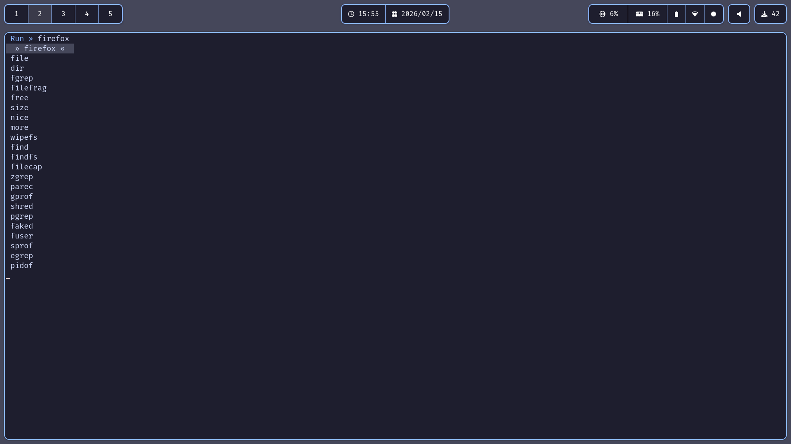

# Termlauncher
Simple terminal based application launcher for Linux, written in C.

## Table of Contents
+ [Todos](#todos)
+ [Documentation](#documentation)
    + [Installation](#installation)
    + [Usage](#usage)
    + [Keys](#keys)

## [Todos](#todos)
- [ ] Color customization for input and list.
- [ ] Flags that adds side effects (like auto close of terminal where launcher was executed).
- [ ] Customization of direcotries in which applications should be searched.

## [Documentation](#documentation)
### [Installation](#installation)
Clone git repo
```
git clone --depth 1 https://github.com/MaksimsTurs/term-launcher.git .
```
Run make script
```
make
```
Make launcher runnable globaly ([how to make programm runnable globaly](https://unix.stackexchange.com/questions/3810/how-can-i-make-a-program-executable-from-everywhere)).

### [Use](#use)
Run `launcher` in your terminal this will open a small input in which you can write the name of the application that you want to run, to select the application, use the arrow up/down keys to move the cursor. If you want that terminal in which you run the application to be closed, run `launcher` with the `-c` flag.

> [!WARNING]
> Term launche support only ASCII characters, special characters like German "ü", "ö" or "ä" are not supported!

### [Keys](#keys)
| Key       | Description        |
| --------- | ------------------ |
| Esc       | Close the launcher |
| Arr. Up   | Move cursor up     |
| Arr. Down | Move cursor down   |
